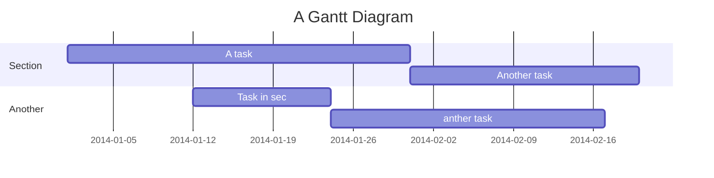

Site AMPLA Ergonomia 
===

Site da empresa Ampla Ergonomia, desenvolvimento eme React com TypeScript e criação de UI/UA Própria. 

Ampla Ergonomia company website, development in react with typeScript , creation of Own UI/UA.

## Table of Contents - Índice

[TOC]

## Start do Projeto - Iniciar o Projeto

Projeto em React e TypeScript - Project in React and TypeScript

1. Inicie o projeto com npm start - Start the project with npm start


User story
---


```gherkin=
Feature: Header - Funcionalidade: Cabeçalho

  # Em conversa com a cliente foi escolhido a cor do fundo do cabeçalho, estilos de letras e logo da marca. 
  # In conversation with the client, the header background color, font styles and brand logo were chosen.
  
  # UI/UX
  Cenário: Usuário vai ter acesso os link de Home , A empresa , Serviço e Contato, um link de contato para o whatsApp, mostra logo da empresa.
  Scenario: The user will have access to the links Home, The company, Service and Contact, a contact link for WhatsApp, showing the company's logo.
  
  # Desenvolvedor - Developer
  Cenário: A esquerda terá o logotipo do cliente, centralizado terá os botões em fonte "Sarabun", direita logotipo do WhatsApp como botão.
  Quando passar o mouse por cima dos botões ele terá uma hover, propriedade de botões Home , A Empresa , Serviço , Contato e ícone do WhatsApp.
  Quando Clicar no ícone do WhatsApp o mesmo vai mandar para o APP ou Web.

  Scenario: The left will have the client's logo, centralized will have the buttons in "Sarabun" font, right WhatsApp logo as a button.
   When hovering the mouse over the buttons it will have a hover, Home , The Company , Service , Contact and WhatsApp icon buttons property.
   When Click on WhatsApp icon it will send to APP or Web.
  
  ## Imagem 1 demostrando como deve ficar !
  ## Image 1 demonstrating how it should look!
  ## Figma do projeto :
```


### Imagem 1


```gherkin=
Feature: Shopping Cart
  As a Shopper
  I want to put items in my shopping cart
  Because I want to manage items before I check out

  Scenario: User adds item to cart
    Given I'm a logged-in User
    When I go to the Item page
    And I click "Add item to cart"
    Then the quantity of items in my cart should go up
    And my subtotal should increment
    And the warehouse inventory should decrement
```

> Read more about Gherkin here: https://docs.cucumber.io/gherkin/reference/

User flows
---
```sequence
Alice->Bob: Hello Bob, how are you?
Note right of Bob: Bob thinks
Bob-->Alice: I am good thanks!
Note left of Alice: Alice responds
Alice->Bob: Where have you been?
```

> Read more about sequence-diagrams here: http://bramp.github.io/js-sequence-diagrams/

Project Timeline
---


> Read more about mermaid here: http://mermaid-js.github.io/mermaid/

## Appendix and FAQ

:::info
**Find this document incomplete?** Leave a comment!
:::

###### tags: `Templates` `Documentation`
